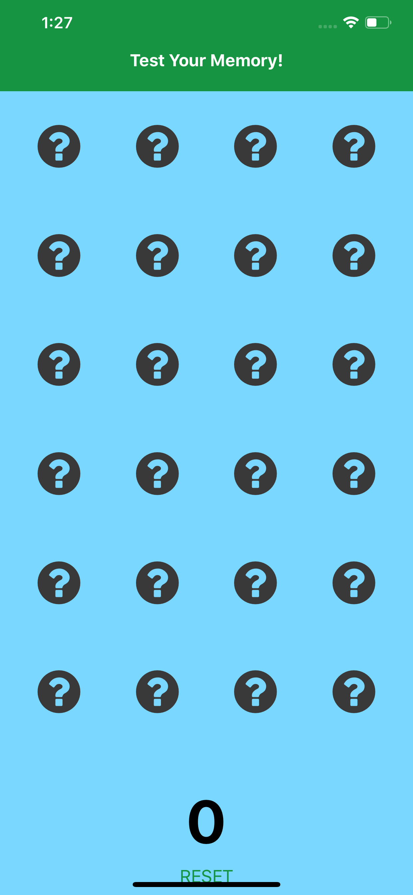
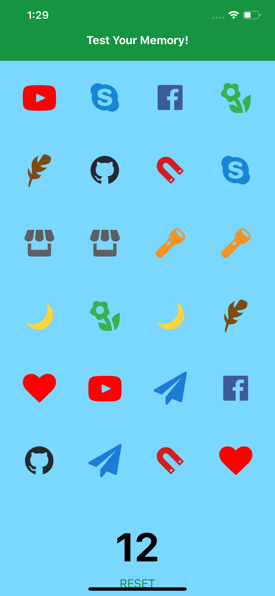
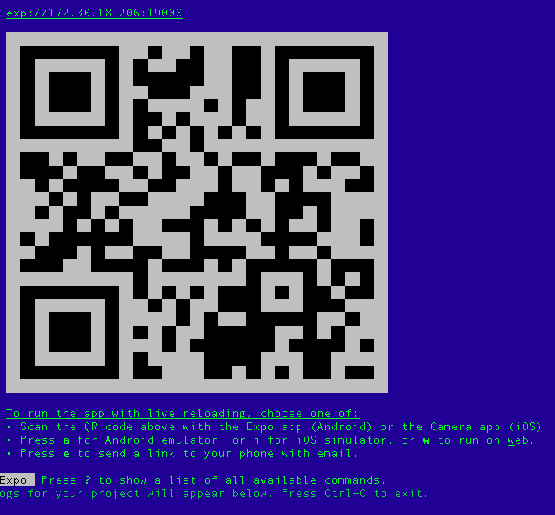

# APP OVERVIEW
The app that we're going to create is a memory game. You may be familiar with this type of game—the user has to find matching pairs by turning over cards two at a time. Here's what the default screen on an iPhone 11 Pro Max looks like:



The final screen looks like this:

 
To start again, the user will have to press the _RESET_ button.

# GETTING STARTED
You will need Expo tools to develop this app. You can get expo tools from [here](https://expo.io/tools).

1. Install the expo CLI globally ```npm install expo-cli --global```
2. Run ```expo init test your memory``` from the terminal.
3. Select a *blank template* from the *managed workflow* list.
4. Type ```cd test your memory``` to enter the *test your memory* directory.
5. Type ```expo start``` to run the project. Expo will generate a QR Code and list other commands that if you want you can use during the course of the project.
6. Use the Expo Client application that you can download from the app store or play store to preview your app. Read [here](https://expo.io/tools) for more information.
7. Scan the generated QR Code which looks like this: 

8. The app should be previewed on the Expo client app by now and every time you make changes to the files of the project, the app will reload automatically to display the latest version of the app.

## THE PROJECT STRUCTURE
At this point the project structure should look like this:
 1. The **assets** folder is used to store files that will be used as assets for the project, such as images.You'll find the two images: one that will be used as the application's icon on the Home screen once you've installed this application on your mobile device, and one that will serve as the splash screen that is displayed when you start the application.

 2. The **node_modules** folder stores all packages that are installed through a package manager such as yarn or npm, and will be used in the project.

 3. The **.gitignore** file contains a list of files that a user wants to exclude from git and therefore they won't be commited.

 4. The **App.js** file is the actual entry point of your application.

 5. The configurations for your application, for example, the App Store, are placed in **app.json**, while **babel.config.js** holds specific Babel configurations.

# APP COMPONENTS
These are the components that the app will use to display its information. Create the **components** folder.

1. Start by creating the **Header.js** file inside the **components** folder. This file will contain the following code which will create the UI of the Header as well as its stylings.

```import React from 'react';
import { StyleSheet, Text, View } from 'react-native';
 
export default class Header extends React.Component {
   
  render() {
    return (
      <View style={styles.header}>
        <Text style={styles.header_text}>MemoryGame</Text>
      </View>
    );
  }
 
}
 
const styles = StyleSheet.create({
  header: {
    flex: 1,
    flexDirection: 'column',
    alignSelf: 'stretch',
    paddingTop: 20,
    paddingBottom: 5,
    backgroundColor: '#f3f3f3'
  },
  header_text: {
    fontWeight: 'bold',
    fontSize: 17,
    textAlign: 'center'
  }
});
``` 

2. Next, create the **Score.js** component file which will display the score and add the following code.
```
import React from 'react';
import { StyleSheet, Text, View } from 'react-native';
 
export default class Score extends React.Component {
   
  render() {
    return (
      <View style={styles.score_container}>
        <Text style={styles.score}>{this.props.score}</Text>
      </View>
    );
  }
 
}
 
const styles = StyleSheet.create({
  score_container: {
    flex: 1,
    alignItems: 'center',
    padding: 10
  },
  score: {
    fontSize: 40,
    fontWeight: 'bold'
  }
});
```

3. Next create the **Card.js** file for the card component which will display the cards. These cards use icons from the Expo vector icon set. This is one of the features that come right out of the box when you use Expo: it includes icons from icon sets like [FontAwesome](https://fontawesome.com/), [Entypo](https://www.entypo.com/), and [Ionicons](http://ionicons.com/). In the code below, you can see that we're only using FontAwesome. It has the icon that we want for displaying the card's default state: a question mark. As you'll see later in the main app component, we'll also be using icons from Entypo and Ionicons. The reference to those icon sources will be passed to this component, so there's no need to specify them here:
```
import React from 'react';
import { StyleSheet, Text, View, TouchableHighlight } from 'react-native';
import { FontAwesome } from '@expo/vector-icons';
```

Inside the render() method, we only use the source and icon passed as props if the card is opened. By default, it will only display the question mark icon from FontAwesome. But if the card is open, it will use the icon source, icon, and color that were passed as props. 

Each of the cards can be tapped. When tapped, the clickCard() function will be run, which is also passed via the props. Later on you'll see what the function does, but for now, just know that it updates the state to reveal the icon on the card:
```
export default class Card extends React.Component {
 
  render() {
     
    let CardSource = FontAwesome; // set FontAwesome as the default icon source
    let icon_name = 'question-circle';
    let icon_color = '#393939';
     
    if(this.props.is_open){
      CardSource = this.props.src;
      icon_name = this.props.name;
      icon_color = this.props.color;
    }
     
    return (
      <View style={styles.card}>
        <TouchableHighlight onPress={this.props.clickCard} activeOpacity={0.75} underlayColor={"#f1f1f1"}>
          <CardSource 
            name={icon_name} 
            size={50} 
            color={icon_color} 
          />
        </TouchableHighlight>   
      </View>
    );
  }
}
```

Add the styles as well;
```
const styles = StyleSheet.create({
  card: {
    flex: 1,
    alignItems: 'center'
  },
  card_text: {
    fontSize: 50,
    fontWeight: 'bold'
  }
});
```

4. We'll also be using a helper function called shuffle(). This allows us to sort the array of cards in random order so that their order will be different every time the game is reset:
```
Array.prototype.shuffle = function() {
  var i = this.length, j, temp;
  if(i == 0) return this;
  while(--i){
   j = Math.floor(Math.random() * (i + 1));
   temp = this[i];
   this[i] = this[j];
   this[j] = temp;
  }
  return this;
}
```

5. Bring it all together in the **App.js** file, which contains the main app logic. Start by including the React and Expo packages that we will be using. This time we're using all of the icon sources from Expo vector icons:
```
import React from 'react';
import { StyleSheet, View, Button } from 'react-native';
import { Ionicons, FontAwesome, Entypo } from '@expo/vector-icons';
```

6. Next, include the components and the helper that we created earlier:
```
import Header from './components/Header';
import Score from './components/Score';
import Card from './components/Card';
import helpers from './helpers';
```

7. Inside the constructor, we first create the array which represents the unique cards. *src* is the icon source, *name* is the name of the icon (you can find the names on [the online expo vector icons library](https://icons.expo.fyi/) if you want to use other icons, and *color* is, naturally, the color of the icon:
```
export default class App extends React.Component {
 
  constructor(props) {
    super(props);
    // bind the functions to the class
    this.renderCards = this.renderCards.bind(this);
    this.resetCards = this.resetCards.bind(this);
     
    // icon sources
    let sources = {
      'fontawesome': FontAwesome,
      'entypo': Entypo,
      'ionicons': Ionicons
    };
 
    // the unique icons to be used
    let cards = [
      {
        src: 'fontawesome',
        name: 'heart',
        color: 'red'
      },
      {
        src: 'entypo',
        name: 'feather',
        color: '#7d4b12'
      },
      {
        src: 'entypo',
        name: 'flashlight',
        color: '#f7911f'
      },
      {
        src: 'entypo',
        name: 'flower',
        color: '#37b24d'
      },
      {
        src: 'entypo',
        name: 'moon',
        color: '#ffd43b'
      },
      {
        src: 'entypo',
        name: 'youtube',
        color: '#FF0000'
      },
      {
        src: 'entypo',
        name: 'shop',
        color: '#5f5f5f'
      },
      {
        src: 'fontawesome',
        name: 'github',
        color: '#24292e'
      },
      {
        src: 'fontawesome',
        name: 'skype',
        color: '#1686D9'
      },
      {
        src: 'fontawesome',
        name: 'send',
        color: '#1c7cd6'
      },
      {
        src: 'ionicons',
        name: 'ios-magnet',
        color: '#d61c1c'
      },
      {
        src: 'ionicons',
        name: 'logo-facebook',
        color: '#3C5B9B'
      }
    ];
 
    // next: add code creating the clone and setting the cards in the state
  }
 
}
```

Note that instead of directly specifying the *src* as *FontAwesome*, *Entypo* or *Ionicons* for each of the objects, we're using the property names used in the *sources* object. This is because we will need to create a copy of the array of cards in order for each card to have a pair. Creating a copy using array methods such as *slice()* will create a copy of the array, but the problem is that once the individual objects are modified in either the copy or the original, both arrays are also modified.<br>

8. This brings us to the solution below which is to create a completely new object by converting the *cards* array into a string and then parsing it to convert it back to an array. This is the reason why we're using strings since functions can't be converted into strings. We then combine the two to come up with the array, which contains all the cards that we need:
```
let clone = JSON.parse(JSON.stringify(cards)); // create a completely new array from the array of cards

this.cards = cards.concat(clone); // combine the original and the clone
```

9. Next, go through that array and generate a unique ID for each one, set the icon source, and then set it to a closed state by default:
```
// add the ID, source and set default state for each card
this.cards.map((obj) => {
  let id = Math.random().toString(36).substring(7);
  obj.id = id;
  obj.src = sources[obj.src];
  obj.is_open = false;
});
```

10. Sort the cards randomly and set the default state:
```
this.cards = this.cards.shuffle(); // sort the cards randomly
 
// set the default state
this.state = {
  current_selection: [], // this array will contain an array of card objects which are currently selected by the user. This will only contain two objects at a time.
  selected_pairs: [], // the names of the icons. This array is used for excluding them from further selection
  score: 0, // default user score
  cards: this.cards // the shuffled cards
}
```
11. The render() method renders the header, cards, score, and the button for resetting the current game. It's using the renderRows() function to render the individual card rows. The screen will have six rows containing four cards each:
```
render() {
  return (
    <View style={styles.container}>
      <Header />
      <View style={styles.body}>
        { 
          this.renderRows.call(this) 
        }
      </View>
      <Score score={this.state.score} />
      <Button
        onPress={this.resetCards}
        title="Reset"
        color="#008CFA"
      />
    </View>
  );
}
```

12. Here's the code for the renderRows() function. This uses the getRowContents() function, which is responsible for creating an array of arrays with four items each. This allows us to render each row, and then use another function for rendering cards for each iteration of the map() function:
```
renderRows() {
  
  let contents = this.getRowContents(this.state.cards);
  return contents.map((cards, index) => {
    return (
      <View key={index} style={styles.row}>
        { this.renderCards(cards) }
      </View>
    );
  });
  
}
```

13. Here's the getRowContents() function:
```
getRowContents(cards) {
  let contents_r = [];
  let contents = [];
  let count = 0;
  cards.forEach((item) => {
    count += 1;
    contents.push(item);
    if(count == 4){
      contents_r.push(contents)
      count = 0;
      contents = [];
    }
  });
 
  return contents_r;
}
```

14. Next is the renderCards() function. This accepts the array of card objects and renders them via the Card component. All we need to do here is to pass the individual properties of each card object as props. This is then used to render the correct icon, as you've seen in the code for the Card component. The clickCard() function is also passed as a prop. The card ID is passed to that function so that the unique card can be identified and updated:
```
renderCards(cards) {
  return cards.map((card, index) => {
    return (
      <Card 
        key={index} 
        src={card.src} 
        name={card.name} 
        color={card.color} 
        is_open={card.is_open}
        clickCard={this.clickCard.bind(this, card.id)} 
      />
    );
  });
}
```

15. Inside the clickCard() function, we get the details of the selected card and check if it should be processed any further:
```
clickCard(id) {
  let selected_pairs = this.state.selected_pairs;
  let current_selection = this.state.current_selection;
  let score = this.state.score;
   
  // get the index of the currently selected card
  let index = this.state.cards.findIndex((card) => {
    return card.id == id;
  });
 
  let cards = this.state.cards;
   
  // the card shouldn't already be opened and is not on the array of cards whose pairs are already selected
  if(cards[index].is_open == false && selected_pairs.indexOf(cards[index].name) === -1){
 
    // next: add code for processing the selected card
 
  }
 
}
```

Now let's fill in the code for handling a selected card.

16. First, we open the card and add it to the array of currently selected cards:
```
cards[index].is_open = true;
     
current_selection.push({ 
  index: index,
  name: cards[index].name
});
 
// next: add code for determining whether the user has selected the correct pair or not
```

17. Once there are two items in the array of currently selected cards, we check if the icon names are the same. If they are then it means that the user has selected the correct pair. If they are not the same then it's an incorrect pair. In that case, we close the first card that was selected and then add a bit of delay before closing the second card. (This way the user can see the card icon before it reverts to the closed state.)
```
if(current_selection.length == 2){
  if(current_selection[0].name == current_selection[1].name){
    score += 1; // increment the score
    selected_pairs.push(cards[index].name); 
  }else{
    cards[current_selection[0].index].is_open = false; // close the first
     
    // delay closing the currently selected card by half a second.
    setTimeout(() => {
      cards[index].is_open = false;
      this.setState({
        cards: cards
      });
    }, 500);
  }
 
  current_selection = [];
}
 
// next: add code for updating the state
```

19. The last thing we need to do in the click event handler is to update the state to reflect the changes in the UI:
```
this.setState({
  score: score,
  cards: cards,
  current_selection: current_selection
});
```

20. A related function is the reset event handler. When the reset button is tapped, we simply restore the default state by closing all the cards and shuffling.
```
resetCards() {
  // close all cards
  let cards = this.cards.map((obj) => {
    obj.is_open = false;
    return obj;
  });
 
  cards = cards.shuffle(); // re-shuffle the cards
   
  // update to default state
  this.setState({
    current_selection: [],
    selected_pairs: [],
    cards: cards,
    score: 0
  });
}
```

21. Finally, we'll add a few basic styles to make our app look good.
```
const styles = StyleSheet.create({
  container: {
    flex: 1,
    alignSelf: 'stretch',
    backgroundColor: '#fff'
  },
  row: {
    flex: 1,
    flexDirection: 'row'
  },
  body: {
    flex: 18,
    justifyContent: 'space-between',
    padding: 10,
    marginTop: 20
  }
});
```

# TEST THE APP
Since your Expo development server has been running this whole time, every change should be pushed to your mobile device with live reloading. Try the app out and make sure it works as it's supposed to.<br>

You can also see it live on Snack [here](https://snack.expo.io/lxPFpIhJU). 